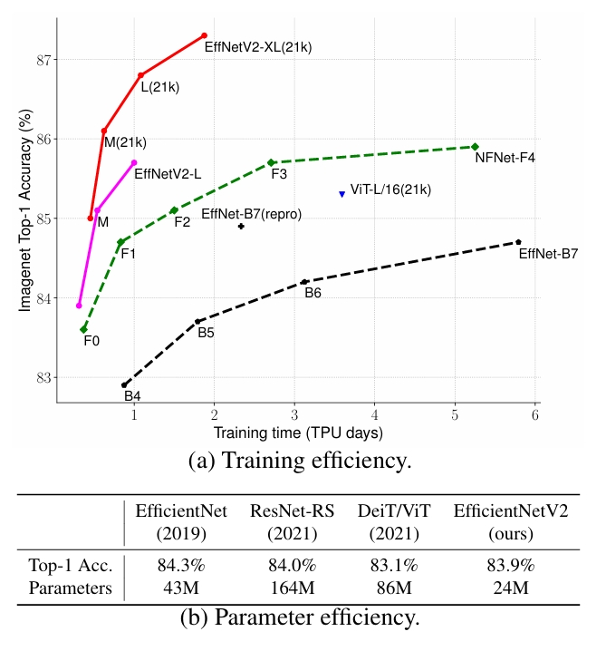
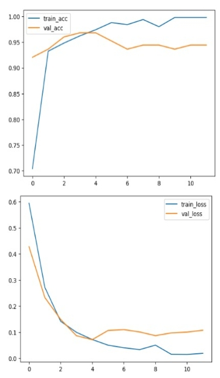
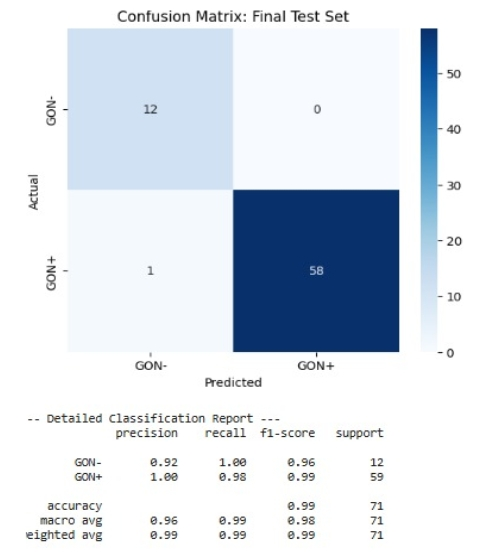

# **Automated Screening System Analysis for Glaucomatous Optic Neuropathy**

Romy Ahsan H., Najma Tsaqiba, M. Dzakil Fikri

## **Problem Statement**

Glaucomatous optic neuropathy (GON) plays a major role in causing irreversible blindness worldwide. It is characterized by damage to retinal ganglion cells, the retinal nerve fiber layer, and the optic nerve, ultimately leading to permanent vision loss and blindness. Although GON is incurable, early detection and treatment can halt or at least slow its progression.

Approximately 50% of GON cases remain undiagnosed, mainly because symptoms, such as vision loss, are often noticed only when the disease has reached an advanced stage. Although GON can be diagnosed, several limiting factors exist, including the availability of ophthalmologists with sufficient expertise and the high cost of diagnostic equipment.

As an alternative, computer-aided analysis of digital fundus images (DFI) can be used to identify GON, enabling the application of deep learning techniques for its detection.

## **Dataset Justification**

Recent studies have increasingly utilized deep learning (DL) models for automated GON detection using digital fundus images (DFIs). However, a major limitation of existing research is that GON reference labels are often derived solely from DFI evaluations rather than comprehensive ophthalmic examinations. DL models trained exclusively on DFIs may inherit biases, be influenced by subjective interpretations and inconsistent annotations, include unverified examples, and potentially diverge from the true clinical manifestation of GON.

The Hillel Yaffe Glaucoma Dataset (HYGD) provides gold-standard GON annotations, where diagnoses are based on comprehensive ophthalmic examinations, including optical coherence tomography (OCT) and visual field (VF) testing, rather than subjective DFI-based evaluations. This dataset aims to enhance the reliability of DL models and reduce biases in automated GON detection.

## **Deep Learning Justification**

We use *EfficientNetV2-S* as our primary architecture for image pattern recognition. *EfficientNetV2 *is an evolution of the Convolutional Neural Networks (CNN) that optimizes the balance between mathematical efficiency and hardware speed. While the previous *EfficientNetV1 *relied solely on *MBConv *blocks to reduce parameter counts, *EfficientNetV2 *introduced Fused-*MBConv* blocks in the early stages. This approach replaces the depthwise convolutions with dense 3 x 3 operations, significantly increasing accuracy while maintaining a lightweight model footprint.

Graph (a) shows the trade-off between accuracy (y-axis) and training time (x-axis). It shows that the *EfficientNetV2 *family significantly surpasses *EfficientNetV1 *and Vision Transformers (ViT) in terms of ImageNet top 1 accuracy while keeping a considerably lower training time. Table (b) provides a comparative analysis of parameter efficiency, it shows that EfficientNetV2 achieves comparable performance with only 24 million parameters, it suggests that the hybrid Fused-MBConv captures higher order features with a significantly lower dimensional parameter space.

EfficientNetV2 offers a superior accuracy to parameter ratio, making it a best choice for minimizing memory overhead while maximizing predictive power. We also use the Contrast Limited Adaptive Histogram Equalization (CLAHE) enhancement technique to maximize EfficientNetV2 performance for image pattern recognition of medical images.

## **Preprocessing Steps**

* **Comma Separated Value type data Preprocessing**

    First, we filtered high quality images from the dataset by applying a rule based on  the *“Quality Score”* column in *Labels.csv, * where only images with a score greater than or equal to 4 were selected ( `df = df[df["Quality Score"] >= 4]). `Then we classified the image and stored it in a directory based on the labels *“GON+”* and *“GON-” *to facilitate further preprocessing of medical image data.

* **Image Type Data Preprocessing**

    We observed that each image contains a slight excess of black background between the border and the circular region of the eye fundus. To remove this unnecessary area, contour detection was applied to identify the boundary of the eye fundus allowing the separation of the eye region from the black background. By detecting the largest contours along both the x-axis and y-axis, the region of interest (ROI) corresponding to the fundus was determined, and the surrounding background was cropped out. This process enabled accurate identification of the fundus boundaries and facilitated precise cropping of the irrelevant regions.

    To address issues of uneven illumination and low contrast, We applied Contrast Limited Adaptive Histogram Equalization (CLAHE) as an images enhancement technique. This process improves local contrast and helps reveal important features, thereby enhancing the EfficientNetV2-S accuracy.

    Finally, the processed and classified images were stored in a directory named *“PROCESSED_224”*, organized based on their labels (*“GON+”* and *“GON-”*), for data splitting and model training.

The images used in this study is publicly available and can be accessed at:  \
[https://tinyurl.com/GONDatasetImages](https://tinyurl.com/GONDatasetImages)

The preprocessed images are stored and can be accessed at:  \
[https://tinyurl.com/GONPreprocessedImages](https://tinyurl.com/GONPreprocessedImages)

## 
**Results**

<table>
  <tr>
   <td width="40%">
      
     
   </td>
   <td>This graph shows the training and validation accuracy and loss. The y-axis represents the accuracy (in decimal) and loss values, while the x-axis represents the number of epochs. In the first graph, we see that the model starts to overfit at epoch 4 when the validation accuracy decreases and plateaus, opening a gap between those two curves. This is confirmed by the second graph where the validation loss increases after epoch 4 and diverges from the training loss. It shows that the model is memorizing the training data rather than generalizing to unseen data. To address this issue, we use EarlyStopping and set a patience value of 7 <code>EarlyStopping(monitor='val_loss',patience=7,verbose=1)</code>. Simultaneously, we also use <code>save_best_only=True</code> parameter to retain only the smallest validation loss. As a result, we achieved a model with 97% accuracy. 
   </td>
  </tr>
  <tr>
   <td width="40%">
      

   </td>
   <td>This is the Confusion matrix for the test dataset to evaluate classification model performance. The results are very good although we have a class imbalance. This class imbalance occurred because the number of samples was insufficient. To address this issue, we calculated the <em>F1-score</em> of the macro average, and then the model got 98%. To minimize the risk of <em>false negatives</em><strong>, </strong>we adjusted the classification threshold to 0.2 <code>y_pred=(Y_pred>0.2).astype(int).flatten()</code>.This adjustment explains the improvement of the <em>F1-score.</em>
   </td>
  </tr>
</table>

The trained model and classification results are available at: \
[https://tinyurl.com/GONDetectionResults](https://tinyurl.com/GONDetectionResults)

## **Interpretability**

The training and validation curves show that the model learns effectively in the early epochs, as both accuracy values increase steadily. However, starting from around epoch 4, a divergence appears where validation accuracy plateaus while the training accuracy continues to improve. It is supported by the loss curves, where the validation loss increases while the training loss decreases, indicating overfitting.

To address this issue, Early Stopping with a patience value of 7 was applied to prevent further overfitting and retain the best model based on validation loss. The confusion matrix shows strong classification performance with only a small number of misclassifications. Despite class imbalance, the model achieves a macro-average F1-score of 98%, indicating balanced performance across both classes.

To reduce the risk of false negatives, the classification threshold is lowered from 0.5 to 0.2, increasing sensitivity. This trade-off is acceptable in medical screening, where missing a disease case is more critical than generating false alarms.

## **Clinical Impact**

The proposed deep learning-based model for detecting glaucomatous optic neuropathy (GON) has strong potential to support clinical practice, particularly in early screening and diagnosis. Since GON is a progressive and irreversible disease, early detection plays a crucial role in preventing permanent vision loss. However, a significant number of cases remain undiagnosed due to limited access to ophthalmologists, high diagnostic costs, and the late appearance of noticeable symptoms.

By leveraging digital fundus images, this model provides an automated, cost-effective, and scalable solution for initial screening. With a high accuracy of 97% and a macro-average F1-score of 98%, the model demonstrates strong capability in distinguishing between GON-positive and GON-negative cases. Furthermore, the adjustment of the classification threshold to prioritize sensitivity ensures that fewer cases are missed, which is particularly important in medical applications.

In real-world settings, this system can be integrated into primary healthcare facilities or telemedicine platforms to assist non-specialist healthcare providers in identifying high-risk patients. This can enable earlier referrals to ophthalmologists, reduce delays in diagnosis, and improve overall patient outcomes. Additionally, the use of clinically validated labels from the HYGD dataset enhances the reliability of the model, making it more aligned with actual clinical conditions rather than subjective image interpretations.

Overall, this model is not intended to replace medical professionals but to serve as a decision-support tool that improves efficiency, accessibility, and early detection of GON, ultimately contributing to the reduction of preventable blindness.

## **Citation**

Abramovich, O., Pizem, H., Fhima, J., Berkowitz, E., Gofrit, B., Meisel, M., et al. (2025). *Hillel Yaffe Glaucoma Dataset (HYGD) (Version 1.0.0)*. PhysioNet. [Hillel Yaffe Glaucoma Dataset (HYGD): A Gold-Standard Annotated Fundus Dataset for Glaucoma Detection v1.0.0](https://physionet.org/content/hillel-yaffe-glaucoma-dataset/1.0.0/)

Tan, M., & Le, Q. V. (2021). *EfficientNetV2: Smaller models and faster training*. In Proceedings of the 38th International Conference on Machine Learning (ICML 2021) (Vol. 139, pp. 10096–10106). PMLR.[ https://arxiv.org/abs/2104.00298](https://arxiv.org/abs/2104.00298)
